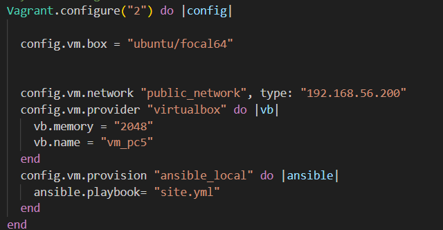
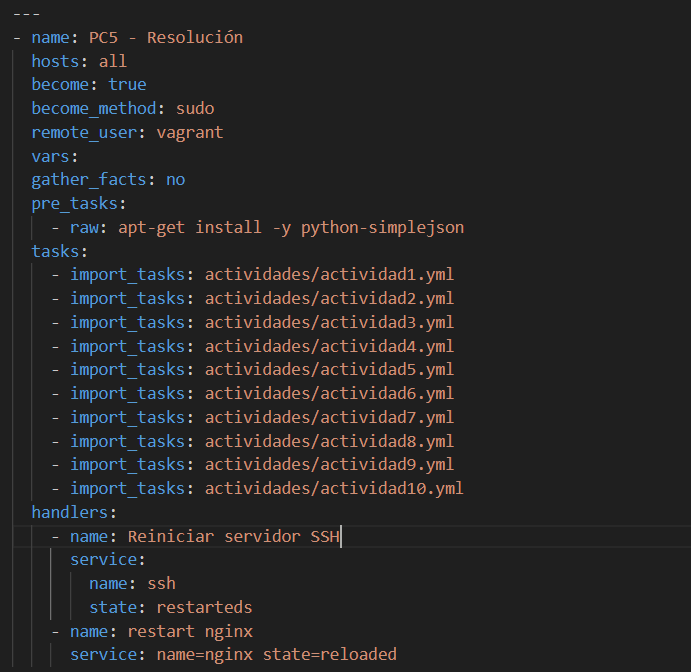
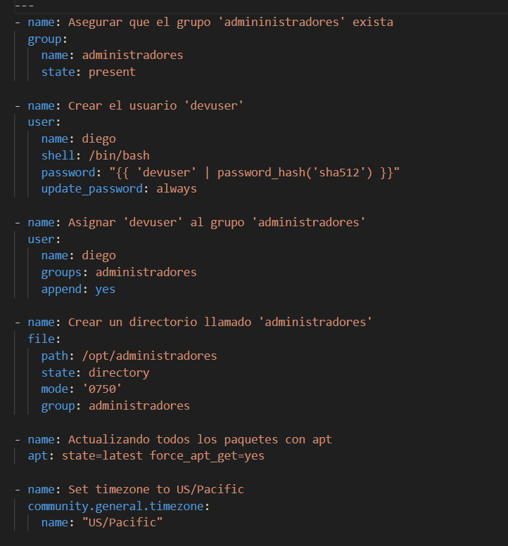
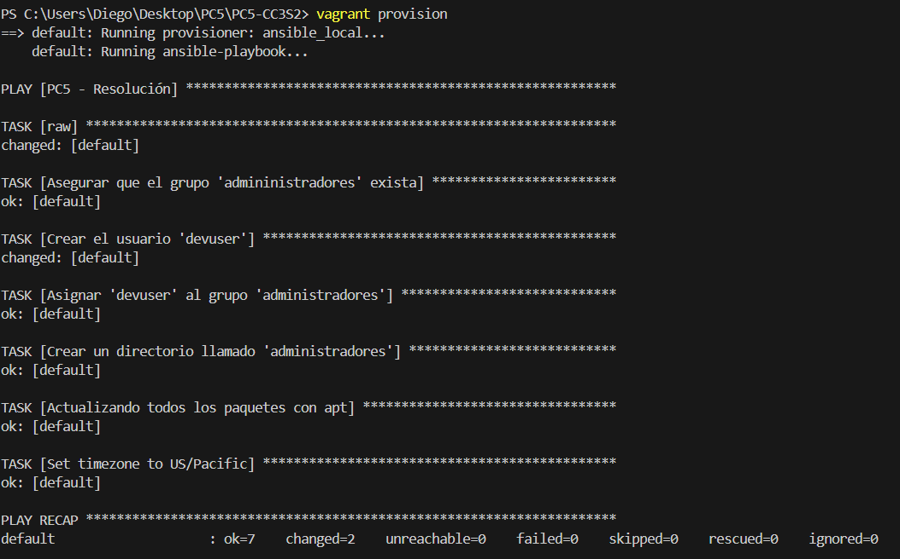

# Documentación de la PC5 

## Archivos iniciales
En primer lugar tenemos algunos archivos adicionales que hemos configurado, los cuales vamos a tomar de los ejercicios que ha dejado el profesor para continuar avanzando.

Esta es la configuración del Vagrantfile, donde vamos a configurar una dirección ip estatica, la cual es la ip 192.168.56.200. Ademas haremos referencia a nuestro site.yml de donde vamos a provisionarnos de las tasks y configuración, ademas le vamos a indicar 2048 de memoria que es lo que solicita la documentación de la práctica

Ahora vamos a ver un primer vistazo de nuestro site.yml, el cual mas adelante vamos a mostrar la versión final de como estaria quedando ya que estaremos avanzando este informe de manera secuencial.

En este documento vamos a tener todos nuestras tasks y cualquier configuración adicional que vamos a necesitar implementar.

## Ejercicio número 1

Para el ejercicio número 1 vamos a implementar la primera parte de la configuración donde vamos a indicar el tema de los usuarios, las actualizaciones y el cambio horario. Para tal motivo vamos a mostrar el  activida1.yml el cual estamos sacando todas las tasks, ademas de apoyarnos un poco de las actividades que ha dejado el profesor en clase

En este apartado estamos configurando el grupo de administradores, vamos a crear el usuario devuser, asignamos el usuario al grupo de administradores, vamos a crear el directorio.

Las dos últimas tareas se realiza la actualización de los paquetes con apt y ademas vamos a definir la zona horaria de "US/Pacific"

Vamos a levantar el vagrant, en este caso ya he levantado anteriormente con vagrant up y no salio ningún problema. En este caso vamos a mostrar como esta leyendo las capturas de manera correcta

## Ejercicio número 2

Vamos a continuar con la configuración del ejercicio número 2, el cual considero que es un poco mas complicado ya que me ha costado realizar la configuración para el levantamiento con el ssl. Pero vamos a explicar paso a paso el enfoque que se ha empleado para lograr el cometido